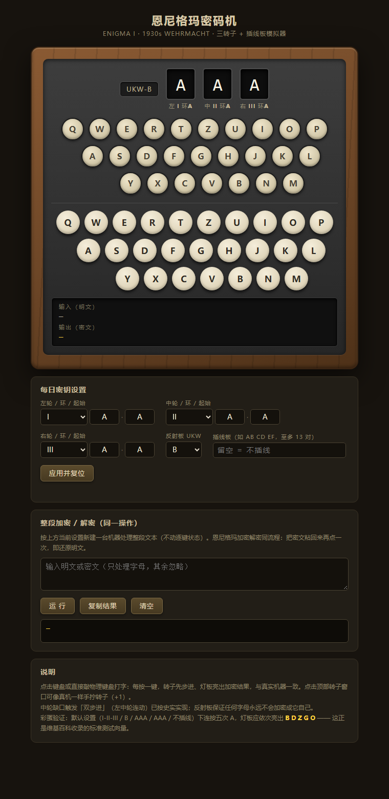

# 恩尼格玛密码机 · Enigma I 模拟器

一个精确复刻二战德军 Enigma I（Wehrmacht 三转子型）工作原理的网页模拟器：木箱 + 金属面板 + QWERTZ 灯板/键盘的仿真实界面，零依赖纯静态实现，打开 `index.html` 即用。



## 功能

- **逐键加密**：点击键帽或直接敲物理键盘，每按一键转子先机械步进、灯板亮出密文字母，与真实机器流程一致
- **完整密钥体系**：5 个转子（I–V）任选 3 个及排列、环设置（Ringstellung）、起始位置、反射板（UKW-A/B/C）、插线板（至多 13 对，非法配置即时报错）
- **史实细节**：中轮缺口双步进（double-step）、反射板互逆性质（字母永不加密成自身、加解密同流程）、德式 QWERTZ 键盘布局（Y/Z 对调）
- **手拧转子**：点击顶部转子窗口可像真机一样直接转动转子设定位置
- **整段文本**：长文本一键加密，密文粘回再点一次即解密；输出按电文惯例 5 字一组
- **明密文对照记录**：像真机旁的记录员一样按 5 字组抄写输入与输出

## 使用

```
直接用浏览器打开 index.html（无需服务器、无需构建）
或运行 start.bat（Windows）
```

每日密钥在「每日密钥设置」卡片中配置，点「应用并复位」生效。

## 验证

核心逻辑与机器解耦（`enigma-core.js`，node 可直跑），确定性自检 33 项断言：

```
node selftest.js   →   TOTAL: 33 passed, 0 failed / ALL PASS
```

覆盖维基百科标准测试向量、双步进序列、反射板性质、长文本往返、非法配置抛错等：

- 默认配置（I-II-III / UKW-B / AAA / AAA / 不插线）连按五次 A → **BDZGO**（维基百科收录向量）
- 双步进锚点：`ADU → ADV → AEW → BFX → BFY`
- 450 次抽样加密中 0 次字母加密成自身

## 文件

| 文件 | 说明 |
|---|---|
| `enigma-core.js` | 纯逻辑核心（UMD）：转子接线、步进、插线板、反射板 |
| `index.html` | 界面（内嵌 CSS/JS，零依赖） |
| `selftest.js` | 确定性自检 |
| `start.bat` | Windows 启动脚本 |

## 背景

恩尼格玛本质上是一台多表代替密码机：插线板 → 三个转子正向 → 反射板 → 三个转子反向 → 插线板。名义密钥空间约 1.6×10²⁰，但结构弱点（字母不自映射、转子步进规律确定、无初始向量）使它在现代算力面前几秒即破——它是机械密码的巅峰之作，也是机械密码的墓志铭。

## 许可证

[MIT](LICENSE)
